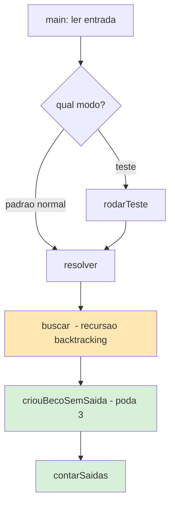
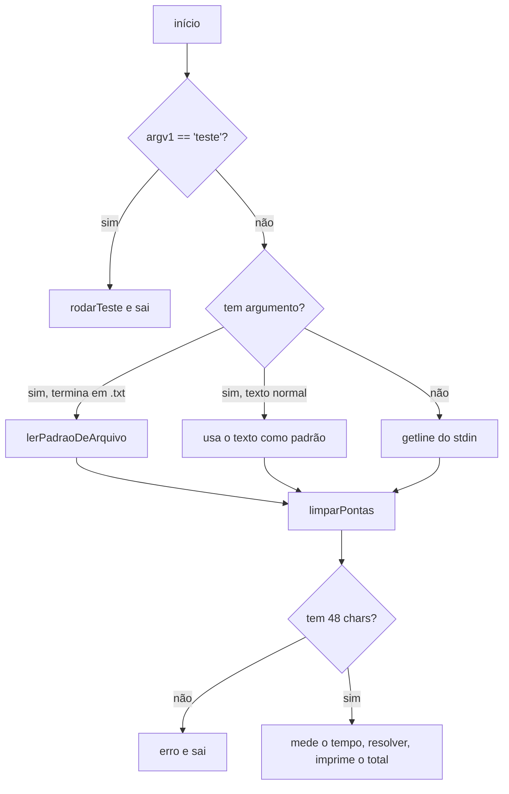
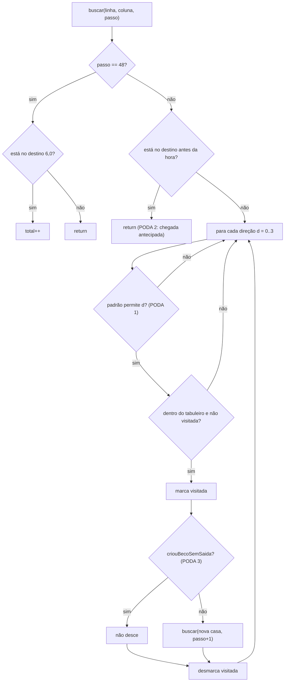
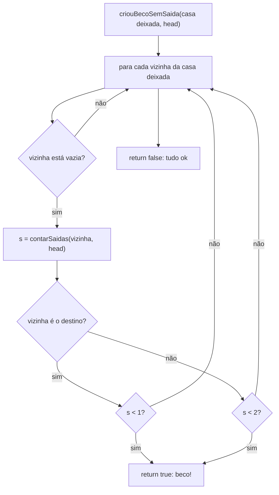

# Documentação detalhada — `caminhos_simples.cpp`

Solução do **Assessment Task** (slide de rodapé "53"): contar caminhos de 48
passos num tabuleiro 7×7, de `(0,0)` a `(6,0)`, passando por todas as 49 casas,
casando com um padrão de 48 caracteres (`?` = qualquer direção).

> Os diagramas estão em **Mermaid** (renderiza no GitHub e no VS Code com a
> extensão *Markdown Preview Mermaid*) e também repetidos em **ASCII** logo
> abaixo de cada um, para leitura sem ferramentas.

---

## 1. Visão geral em uma imagem

O programa é um **backtracking** (busca em profundidade que volta atrás) sobre as
casas do tabuleiro, com **3 podas** que cortam ramos sem futuro para caber no
tempo. Tudo gira em torno de uma matriz `visitado[7][7]`.



```
                 +------------------------+
                 |  main: ler a entrada   |
                 |  (texto, .txt ou pipe) |
                 +-----------+------------+
                             |
                   qual modo foi pedido?
            +----------------+----------------+
            |                                 |
        "teste"                          padrao normal
            |                                 |
            v                                 v
      rodarTeste()                       resolver()
            |                                 |
            +------------> resolver() <-------+
                              |
                              v
                         buscar()   <--- recursao (backtracking)
                              |
                              v
                    criouBecoSemSaida()   (PODA 3)
                              |
                              v
                       contarSaidas()
```

---

## 2. Mapa das funções (o que cada uma faz)

| Função | Papel | Chamada por |
|---|---|---|
| `main` | Lê a entrada (argumento, arquivo `.txt` ou stdin) e decide o modo. | — |
| `limparPontas` | Tira espaços/quebras de linha das pontas da string. | `main` |
| `terminaEmTxt` | Diz se o argumento é um nome de arquivo `.txt`. | `main` |
| `lerPadraoDeArquivo` | Abre o `.txt` e lê a 1ª linha não vazia. | `main` |
| `resolver` | Zera o tabuleiro, marca o início e dispara a busca. | `main`, `rodarTeste` |
| `buscar` | **O coração**: backtracking recursivo + podas 1 e 2. | ela mesma (recursão) |
| `criouBecoSemSaida` | **Poda 3**: detecta se um movimento isolou alguma casa. | `buscar` |
| `contarSaidas` | Conta quantas "portas livres" uma casa tem (para a poda 3). | `criouBecoSemSaida` |
| `rodarTeste` | Modo `teste`: confere 88418 e 201 e mede o tempo. | `main` |

---

## 3. Estruturas de dados

```
visitado[7][7]   matriz de bool. true = "ja passei por esta casa".
                 É o que impede repetir casa (a regra do caminho Hamiltoniano).

dLinha[4] / dColuna[4] / letra[4]   as 4 direções, alinhadas por índice:
    índice d:     0      1      2      3
    letra:        D      U      L      R
    dLinha:      +1     -1      0      0     (linha cresce para baixo)
    dColuna:      0      0     -1     +1

  Coordenadas:  (linha, coluna), com (0,0) no canto superior-esquerdo.
  Início = (0,0).   Destino = (6,0) = canto inferior-esquerdo.
```

Mapa do tabuleiro (cada célula mostra a coordenada `linha,coluna`):

```
        col0   col1   col2  ...  col6
 lin0  [0,0]  [0,1]  [0,2]  ...  [0,6]   <- INÍCIO em [0,0]
 lin1  [1,0]  [1,1]   ...
 lin2  ...
 ...
 lin6  [6,0]  ...                 [6,6]  <- DESTINO em [6,0]
```

---

## 4. `main` — leitura da entrada e escolha do modo



```
main:
  se argv[1] == "teste"   -> rodarTeste(); fim
  senão (modo normal):
     se tem argumento:
        termina em ".txt"? -> lerPadraoDeArquivo()
        senão              -> usa o texto como padrão
     senão                 -> getline(stdin)
     limparPontas()
     tem 48 caracteres?  não -> erro
                          sim -> mede o tempo, imprime resolver(entrada)
                                 e o tempo de execução (em stderr)
```

**Detalhe da leitura por arquivo:** a regra é simples — *se o argumento termina
em `.txt`, leio o arquivo; senão, é o próprio padrão*.

---

## 5. `buscar` — o coração (backtracking) + Podas 1 e 2

A recursão representa "estou na casa (linha,coluna), já dei `passo` movimentos".
Para cada direção permitida, ela **marca** a casa nova, **desce** e depois
**desmarca** (é o "voltar atrás" do backtracking).



```
buscar(linha, coluna, passo):
  | se passo == 48:                         <- fim do caminho
  |     se (linha,coluna) == destino: total++
  |     return
  |
  | se (linha,coluna) == destino: return     <- PODA 2 (chegada antecipada)
  |
  | para cada direcao d em [D,U,L,R]:
  |     se padrao[passo] fixa outra letra: pula        <- PODA 1 (filtro)
  |     calcula (nl,nc) = vizinha na direcao d
  |     se fora do tabuleiro ou ja visitada: pula
  |     visitado[nl][nc] = true              <- MARCA
  |     se NAO criouBecoSemSaida(...):       <- PODA 3
  |         buscar(nl, nc, passo+1)          <- DESCE (recursao)
  |     visitado[nl][nc] = false             <- DESMARCA (backtracking)
```

### O padrão "marca → desce → desmarca"
```
      visitado[nl][nc] = true;     // tento ocupar a casa
      buscar(...);                 // exploro tudo que começa por aqui
      visitado[nl][nc] = false;    // desfaço, para tentar outra direção
```
É isso que permite reaproveitar a mesma matriz `visitado` para todos os ramos,
sem cópias — barato em memória e em tempo.

---

## 6. As técnicas de otimização (por que cabe em < 1 segundo)

Sem nenhuma poda o caso `tudo-?` levaria **~105 segundos**. As 3 podas + `-O2`
derrubam para **~0,22 segundo**. Veja a progressão medida:

```
 Versão                                   Tudo-?         Exemplo
 -------------------------------------    -----------    --------
 Backtracking puro (sem poda)             ~105 000 ms     6 681 ms     (inviável)
 + poda varrendo o tabuleiro inteiro        ~970 ms          60 ms
 + poda incremental (só vizinhos) FINAL      ~220 ms          14 ms     (OK!)
```

### PODA 1 — Filtro do padrão  (dentro de `buscar`)
Se o caractere do passo é uma letra fixa (ex.: `R`), só tentamos **essa**
direção; as outras 3 são puladas na hora.

```
   padrão[passo] = 'R'        padrão[passo] = '?'
   tenta:  só R               tenta:  D, U, L, R
   ramificação 4 -> 1         ramificação 4
```
É por isso que o **exemplo** (cheio de letras) roda em ~14 ms, muito mais rápido
que o **tudo-?** (~220 ms): cada letra fixa "corta" 3 dos 4 ramos.

### PODA 2 — Chegada antecipada  (dentro de `buscar`)
Se caímos no destino `(6,0)` **antes** do 48º passo, não adianta continuar:
para seguir teríamos de sair do destino e voltar, repetindo casa. Abandona já.

```
   ... -> [6,0] no passo 30 ?   ->  return  (impossível completar)
```

### PODA 3 — Beco sem saída  (`criouBecoSemSaida` + `contarSaidas`)
A poda mais poderosa (é a que tira os ~105 s). Ideia:

> Para o caminho cobrir **todas** as casas, cada casa vazia precisa ser
> **atravessada**: entrar por uma porta e sair por outra → precisa de **≥ 2
> saídas** (vizinhos livres). A única exceção é o **destino**, que é ponta do
> caminho e precisa de **≥ 1**.

Se algum movimento deixa uma casa vazia com saídas demais de menos, ela virou um
beco — nunca completaríamos o caminho — então não descemos por ali.

```
   Exemplo de beco (X = visitada, . = livre, # = a casa testada):

        X X X            A casa '#' tem só 1 saída livre (a de baixo).
        X # X            Se ela não for o destino, é um beco:
        X . X            ninguém consegue entrar E sair dela.  -> PODA
```

**O truque que deixa rápido (incremental):** quando saímos de uma casa, as únicas
casas cujo número de saídas pode ter **diminuído** são **as vizinhas da casa que
acabamos de deixar**. Então `criouBecoSemSaida` checa só essas (no máximo 4), em
vez de varrer as 49 casas a cada passo. Mesma resposta, bem mais rápido
(970 ms → 220 ms).



```
criouBecoSemSaida(casa_deixada, head):
   para cada vizinha da casa_deixada:
      se vizinha está visitada: pula
      s = contarSaidas(vizinha, head)
      se vizinha é o destino:   se s < 1 -> return true (beco)
      senão:                    se s < 2 -> return true (beco)
   return false
```

### `contarSaidas` — apoio da Poda 3
Conta os vizinhos de uma casa que são "portas": livres **ou** a casa atual (o
*head*, de onde o caminho ainda vai sair). Para de contar ao chegar em 2, porque
só interessa saber se há 0, 1 ou ≥2.

```
contarSaidas(l, c, head):
   saidas = 0
   para cada uma das 4 direções:
      vizinha dentro do tabuleiro?
         e (livre OU é o head)?  -> saidas++
         se saidas >= 2: return 2     (não precisa contar mais)
   return saidas
```

> **Por que contar o head como porta?** A casa onde estamos agora ainda vai
> *sair* no próximo passo, então para uma casa vizinha vazia ela conta como uma
> entrada possível. Sem isso, a poda cortaria caminhos válidos e a contagem ficaria
> **errada** (foi um bug real corrigido durante o desenvolvimento).

### BÔNUS — flags de compilação
```
-O2       liga otimizações do compilador (várias vezes mais rápido, de graça)
-static   embute as bibliotecas no .exe (roda em qualquer Windows e evita
          erro ao abrir arquivos por falta de DLLs do MinGW)
```

---

## 7. Complexidade e desempenho

- **Pior caso teórico:** exponencial (é uma busca em árvore). Mas o tabuleiro é
  pequeno (49 casas) e as 3 podas cortam quase tudo que não leva a solução.
- **Número de caminhos (padrão tudo-?):** 88 418.
- **Tempo medido (g++ -O2 -static):** ~220 ms no pior caso, ~14 ms no exemplo.
- **Memória:** uma matriz `bool[7][7]` reaproveitada (graças ao marca/desmarca).

### Por que NÃO usei Programação Dinâmica?
DP exige **subproblemas repetidos** e um **estado pequeno** que caiba numa tabela.
Aqui o estado teria de incluir **o conjunto de casas já visitadas** (para não
repetir) — são `2^49` combinações, não cabe em tabela. Por isso a ferramenta
certa é **backtracking com podas** (a ideia de *Branch and Bound* do material:
cortar cedo os ramos que comprovadamente não levam a solução).

---

## 8. Resumo dos arquivos

| Arquivo | Conteúdo |
|---|---|
| `caminhos_simples.cpp` | Código-fonte comentado. |
| `caminhos_simples.exe` | Binário estático já compilado. |
| `entrada.txt` | Exemplo de padrão (com `?`). |
| `DOCUMENTACAO.md` | Este documento (diagramas + explicação por função). |
| `ANALISE_SIMPLES.md` | Foco nas otimizações e medições de tempo. |
